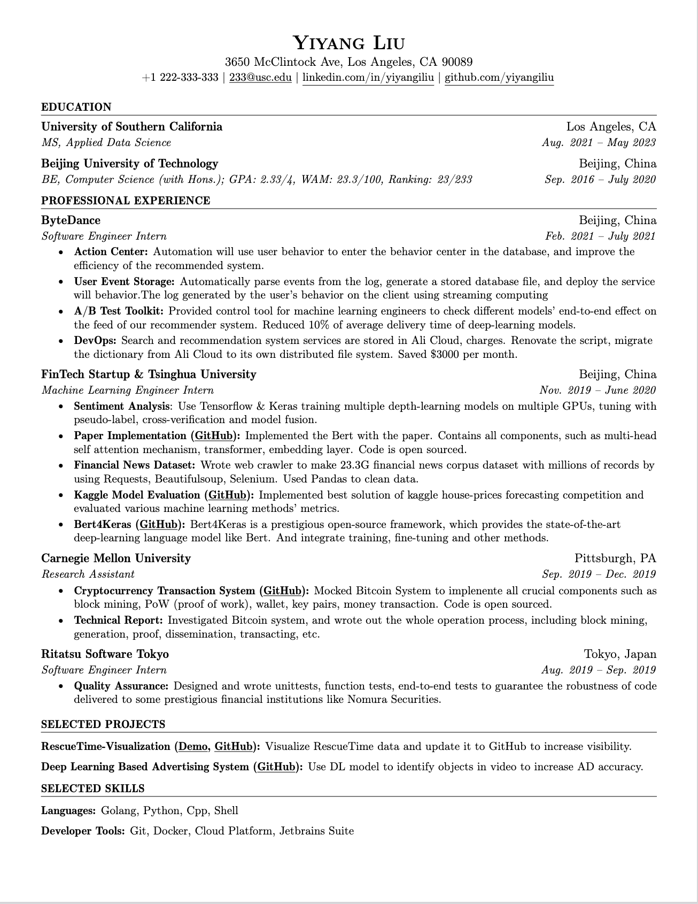

## Resume

Clean, elegant, project-based cv template for cs students seeking intern / new grad jobs.

> <b>Amazon Web Services (AWS)</b>
>
>> 

Software Engineer Intern</b>

>>
>> 
>>
>
> <b>TikTok</b>
>
>> 

 Software Engineer Intern 

>>
>> 
>
> 

<b>Selected Other Online Assessments</b> received by using this CV

> 
>> <b>Meta </b>
>>
>>> 

Enterprise Engineer Intern (aka SDE in EE org) 

>>>
>>> 
>> 
>>> 

Pruduction Engineer Intern (aka SRE) 

>>>
>>> 
>> 
>>> 

Pruduction Engineer Intern - from another hr 

>>>
>>> 
>>
>>> 

Data Center Systems Engineer Intern 

>>>
>>> 
>>
>>> 

 Q&A: 

>>>
>>>> <b>Why didn't you receive SDE position?</b>
>>>>
>>>> That's a question I want to know, too!
>>>>
>>>
>>>> <b>Why you received 2 PE positions?</b>
>>>>
>>>> Obviously, I know some tricks :)
>>>
>
>> 

<b>Akuna Capital </b>

>>
>>> 

Quant Develoepr 

>>>
>>> 
>> 
>>> 

C++ Developer

>>>
>>> 
>> 
>>> 

Python Developer

>>>
>>> 
>> 
>>> 

Web Developer

>>>
>>> 
>
>> 

<b>Hudson River Trading</b>

>>
>> Software Engineer Intern
>>
>> 
>
>> 

<b>Optiver</b>

>>
>> Software Engineer Intern
>>
>> 
>>
>> DevOps Software Intern
>>
>> 
>
>> 

<b>Citadel</b>

>>
>> Software Engineer Intern
>>
>> 
>>
>> 
>
>> 

<b>Duolingo</b>

>>
>> Software Engineer Intern
>>
>> 
>>
>> 
>>
>>
>
>> 

<b>WeRide</b>

>>
>> Software Engineer Intern
>>
>> 
>>
>
>> 

<b>Databricks</b>

>>
>> Software Engineer Intern
>>
>> 
>>
>
>> 

<b>Quora</b>

>>
>> Software Engineer Intern
>>
>> 
>>
>> 
>
>> 

<b>Samsara</b>

>>
>> Software Engineer Intern
>>
>> 
>>
>> 
>>
>> 
>>
>
>> 

<b>MathWorks</b>

>>
>> Software Engineer Intern
>>
>> 
>>
>
>> 

<b>Nuro ai</b>

>>
>> Software Engineer Intern
>>
>> 
>>
>
>> 

<b>Barclays</b>

>>
>> Developer Analyst - Explorer Summer Intern
>>
>> 
>>
>
>> 

<b>Instabase</b>

>>
>> Software Engineer Intern
>>
>> 
>
>> 

<b>JPMC</b>

>>
>> Software Engineer Program - Summer Internship
>>
>> 
>>
>
>> 

<b>IMC</b>

>>
>> Software Engineer Intern
>>
>> 
>
>> 

<b>Goldman Sachs</b>

>>
>> Software Engineer Intern
>>
>> 
>
>> 

<b>Prudential</b>

>>
>> Software Engineer Intern
>>
>> 
>
>> 

<b>Pimco</b>

>>
>> Software Engineer Intern
>>
>> 
>
>> 

<b>PwC</b>

>>
>> Technology Consulting Intern
>>
>> 
>
>> 

<b>Unilever</b>

>>
>
>> 

<b>Okta</b>

>>
>> Software Engineer Intern
>>
>> 
>
>> 

<b>Discovery</b>

>>> 
>
>> 

<b>Robinhood</b>

>>
>> Software Engineer Intern
>>
>> 
>
>> 

<b>Salesforce</b>

>>
>> Software Engineer Intern
>>
>> 
>>
>> 
>
>> 

<b>Riot Games</b>

>>
>> Software Engineer Intern
>>
>> 
>>
>> 
>
>> 

<b>BCG</b>

>>
>> Full-time Associate or Summer Associate Internship
>>
>> 
>>
>> 
>
>> 

<b>Susquehanna International Group (SIG)</b>

>>
>> Software Engineer Intern
>>
>> 
>

### Result

**35+** Online Assessments Received. 

One of Top Performers among Peers.

Companies including **Amazon**, **TikTok**, **HRT**, **Citadel**, **Databricks**, **Meta**, etc.

### View Online

[Yiyang Liu Resume - Online LaTeX Editor Overleaf](https://www.overleaf.com/read/dbdqjmycfsbq)

### Special Thanks

* Jake Gutierrez (https://github.com/jakegut/resume)
* Sourabh Bajaj (https://github.com/sb2nov/resume)

### Preview

### License

Format is MIT but all the data is owned by Yiyang Liu.
